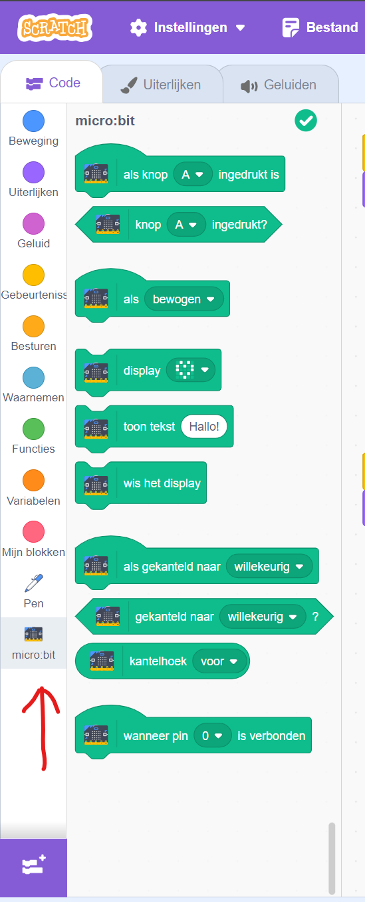
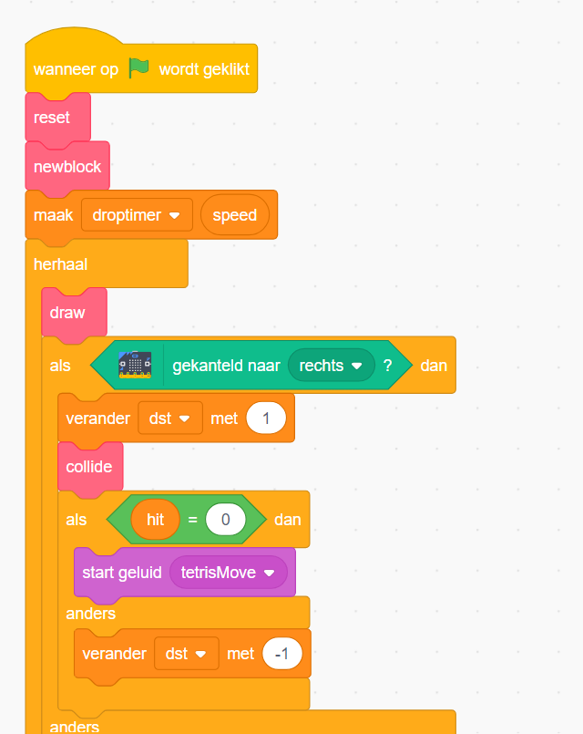
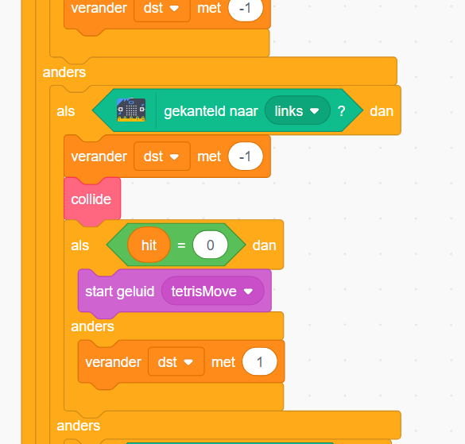
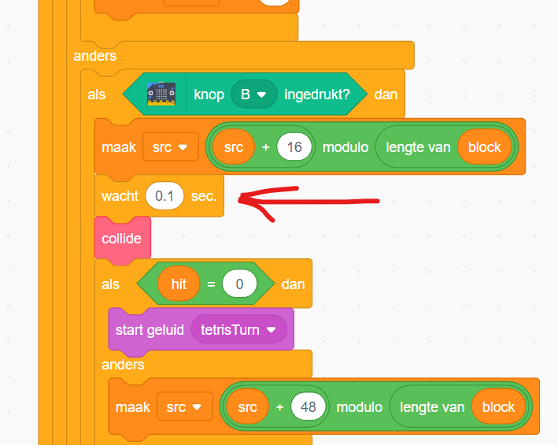
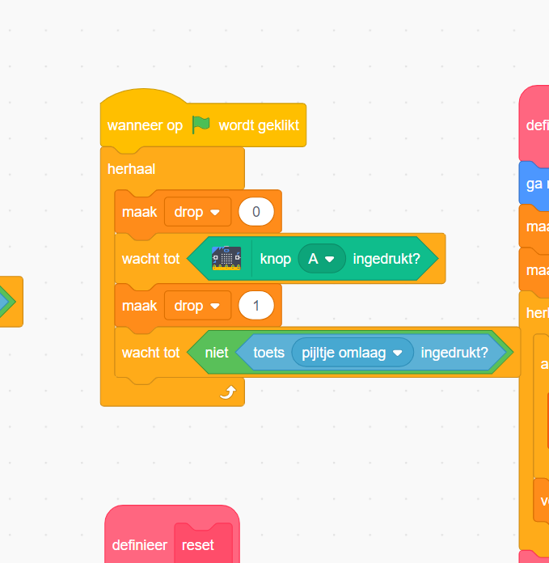
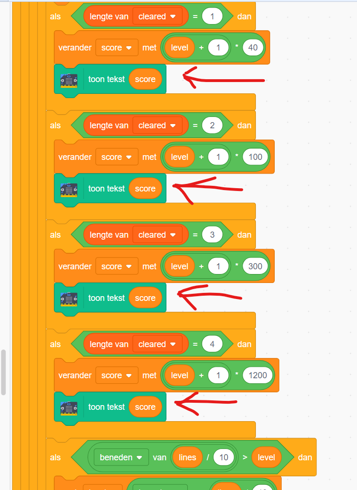

# Tetris
Een project voor de bibliotheek Heerenveen waar we de Micro:bit als een controller voor tetris in scratch bouwen. 

Wat heb je nodig
- Micro:bit
- een laptop met internet
- Ga naar Scratch, https://scratch.mit.edu/
- Schakel de Micro:bit extensie in, zodat er aan de linkerkant de volgende optie beschikbaar wordt:

Onderstaande stappen laten je kennis maken met alle onderdelen. Probeer eerst zelf de oplossing te maken. Bij iedere stap zit een uitwerking, deze kun je bekijken als je zelf er even niet uitkomt.

## Welkom (stap1)
**doel:** Spel tetris begrijpen en code begrijpen  
**wat moet je done?**
- Vind een bestaand tetris spel op scratch die we als basis gaan gebruiken tijdens deze opdracht.
- Speel het spel voor een paar minuten zodat je begrijpt hoe het werkt.
- Bekijk hierna de code, zodat je begrijpt waar de code zit die de besturing van de blokjes doet.
**Let op!** Zorg dat je niet te lang bezig met bent met het zoeken en spelen (maximaal 5 a 10 minuten). Het programmeren begint pas bij stap 2!

uitwerking: Welkom (stap1)

Het volgende spel in Scratch is een goede om deze opdracht mee te doen. Je mag een andere gebruiken als je wilt, maar dit kan wat ingewikkelder zijn.
https://scratch.mit.edu/projects/31651654/
test

## Maak een controller van de Micro:bit (stap2)
**doel:** Bestuur de blokken met de Micro:bit
**wat moet je doen?**
- Zoek de blokken code die ervoor zorgen dat de blokjes naar links en rechts gaan, draaien en sneller naar beneden
- Zorg ervoor dat links en richts aangestuurd wordt door de micro:bit naar links en rechts te kantelen
- Zorg ervoor dat sneller naar beneden en draaien aangestuurd wordt door de knoppen a en b op de micro:bit

uitwerking: Maak een controller van de Micro:bit (stap2)

- Klik op de sprite Tetronimo
- Pas het code blok voor rechts aan, zodat het er zo uit komt te zien:

- Pas het code blok voor links aan, zodat het er zo uit komt te zien:

 
- Pas het code blok voor draaien aan, zodat het er zo uit komt te zien:

Let op! Voeg een blok wacht met 0.1 seconden toe.

- Pas het code blok voor sneller naar beneden aan, zodat het er zo uit komt te zien:

Let op! Dit block staat ergens rechtsboven, goed zoeken!

## Toon aantal punten (stap3)
**doel:** Toon aantal punten op micro:bit
**wat moet je doen?** Toon de score op het scherm van de micro:bit als de score verhoogd wordt

uitwerking: Toon aantal punten op micro:bit

## hoe wil je tetris uitbreiden? (extra stap)
**surgesties:**  
* Toon een hartje als je 2 lijnen weggehaald hebt [moeilijkheidsgraad: LAAG]
* Toon de Scratch kat die zegt "Lekker bezig!" als je 100 punten hebt behaald: MIDDEN]
* Toon een knop waarmee het geluid uitgezet kan worden: MIDDEN]
* Toon de vorm van het volgende blokje op de Micro:bit [moeilijkheidsgraad: MOEILIJK]
